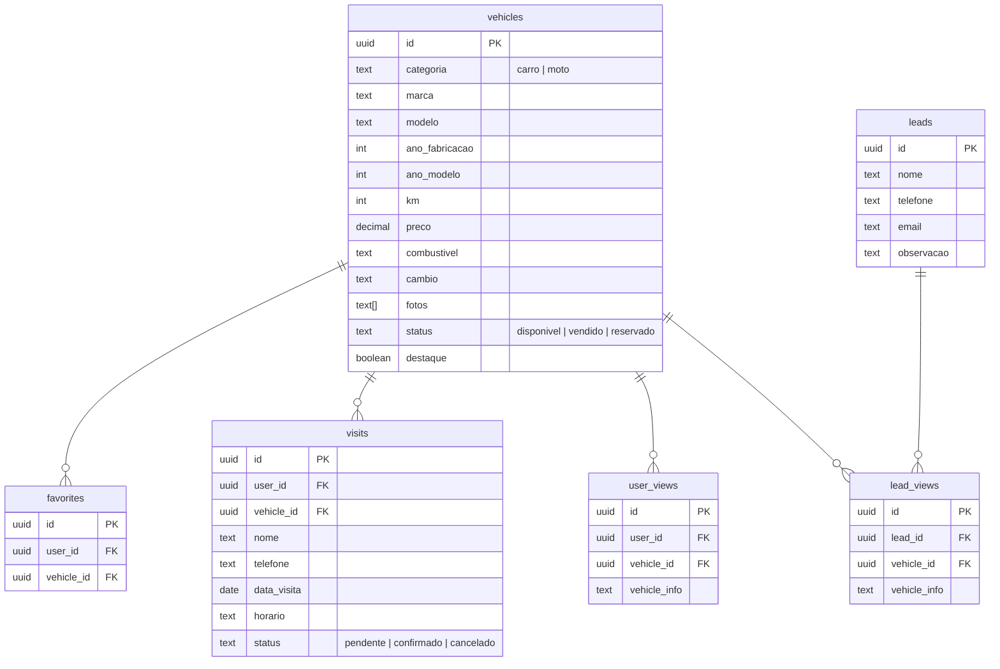

#  AngVeículos

Plataforma completa de compra e venda de veículos com painel administrativo, cadastro de clientes, agendamento de visitas e integração com WhatsApp.

## 🛠 Stack

| Tecnologia | Uso |
|------------|-----|
| **Next.js 14** (App Router) | Frontend + API |
| **TypeScript** | Tipagem |
| **Tailwind CSS** | Estilização |
| **Supabase** | PostgreSQL, Auth, Storage |
| **Vercel** | Hospedagem |

##  Funcionalidades

### Público
- Home com busca por nome, filtro por categoria (carros/motos) e veículos em destaque
- Página de detalhes com galeria de fotos, lightbox com zoom, swipe em mobile e navegação por teclado
- Especificações técnicas organizadas por categoria
- Veículos similares na página de detalhes
- Solicitação de visita presencial
- Formulário de interesse para não cadastrados
- Link direto para WhatsApp com dados do veículo pré-preenchidos

### Cliente
- Cadastro com nome, WhatsApp, e-mail e senha
- Login e recuperação de senha
- Favoritar veículos (❤️)
- Agendamento de visitas
- Painel de favoritos e visitas agendadas
- Configurações de perfil (nome, telefone, e-mail, senha)

### Administrador
- Dashboard com estatísticas (veículos, leads, visitas, usuários)
- CRUD completo de veículos com upload de fotos e captura pela câmera
- Cadastro organizado por categoria (carro/moto) com marcas e modelos pré-definidos
- Gerenciamento de leads com histórico completo:
  - Visualizações de veículos
  - Favoritos
  - Visitas agendadas (confirmar/cancelar)
- Atividade recente em tempo real

##  Modelo de Dados



## 🚀 Começando

```bash
# Instalar dependências
npm install

# Configurar variáveis de ambiente
cp .env.example .env.local

# Rodar em desenvolvimento
npm run dev
```

### Variáveis de Ambiente

```env
NEXT_PUBLIC_SUPABASE_URL=https://seu-projeto.supabase.co
NEXT_PUBLIC_SUPABASE_ANON_KEY=sua_chave_anon
SUPABASE_SERVICE_KEY=sua_chave_service_role
```

##  Estrutura

```
src/
├── app/
│   ├── admin/           # Painel administrativo
│   │   ├── dashboard/   # Estatísticas e atividade recente
│   │   ├── leads/       # Leads e usuários com histórico
│   │   ├── login/       # Login admin
│   │   └── veiculos/    # CRUD de veículos
│   ├── cadastro/        # Cadastro de cliente
│   ├── configuracoes/   # Perfil do cliente
│   ├── favoritos/       # Favoritos e visitas
│   ├── login/           # Login do cliente
│   ├── recuperar-senha/ # Recuperação de senha
│   ├── atualizar-senha/ # Redefinição de senha
│   └── veiculo/[id]/    # Página de detalhes
├── components/          # Componentes reutilizáveis
├── data/                # Marcas e modelos (carros/motos)
└── lib/                 # Clientes Supabase, tipos
```

##  Deploy

O projeto está configurado para deploy na **Vercel** com `vercel.json`:

```json
{
  "framework": "nextjs",
  "buildCommand": "npm run build",
  "outputDirectory": ".next",
  "installCommand": "npm install"
}
```

## 📄 Licença

MIT

---

Feito  por [Erik Martins](https://github.com/ErikMartinsss-hub)
